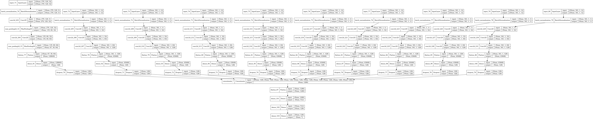

# Revisiting the Deep Learning-based Eavesdropping Attacks via Facial Dynamics from VR Motion Sensors

> **Soohyeon Choi**, **Manar Mohaisen**, **Daehun Nyang**, and **David Mohaisen**
> *International Conference on Information and Communications Security (ICICS)*
> [[Paper]](assets/FaceMic_ICICS.pdf)

## Overview

Virtual Reality (VR) head-mounted displays (HMDs) contain motion sensors that have been exploited for deep learning-based eavesdropping attacks leveraging facial dynamics. Since facial dynamics vary across race and gender, we evaluate the **robustness** of such attacks under diverse user characteristics.

Based on anthropological research showing statistically significant differences in face width, length, and lip length among ethnic/racial groups, we hypothesize that a "challenger" with similar features (ethnicity/race and gender) to a victim can more easily deceive the eavesdropper. We validate this through **six attack scenarios** varying the victim and attacker's ethnicity/race and gender.

### Key Findings

- An adversary with the **same ethnicity/race and gender** as the victim achieves the highest impersonation accuracy (lowest accuracy difference from the original setting)
- An adversary with a **different ethnicity/race and gender** shows the highest accuracy difference, emphasizing an inherent bias in facial-dynamics-based eavesdropping

## Architecture

The model uses a **multi-channel CNN** that fuses:
- **Spectrograms** from STFT of accelerometer data
- **9 motion sensor channels**: Acceleration (x, y, z), Velocity (x, y, z), Position (x, y, z)

<p align="center">
  
</p>

## Repository Structure

```
Revisiting_Face-Mic/
├── assets/
│   ├── FaceMic_ICICS.pdf               # Published paper
│   └── multichannel.png                # Model architecture diagram
├── data/
│   ├── csvfiles/                       # Raw motion sensor CSV data
│   │   ├── targeted_attack/            # 6 targeted attack scenarios
│   │   └── untargeted_attack/          # 6 untargeted attack scenarios
│   ├── spectrograms/                   # STFT spectrogram images
│   │   ├── targeted_attack/
│   │   └── untargeted_attack/
│   ├── preprocessed_csv_data/          # Preprocessed sensor data per user
│   └── new_segmented_spectrograms/     # Segmented spectrograms per user
├── src/
│   ├── targeted_attack_*.py            # Targeted attack experiments
│   ├── untargeted_attack_*.py          # Untargeted attack experiments
│   ├── csv_check.py                    # Data inspection utility
│   └── STFT.ipynb                      # STFT spectrogram generation notebook
└── test/
    └── Result/                         # Experiment results
        ├── targeted_attack/            # Targeted attack accuracy logs
        └── untargeted_attack/          # Untargeted attack accuracy logs
```

## Attack Scenarios

Each scenario is named by the ethnicity/race and gender pairing of the **victim** and **attacker**:

| Script Suffix | Victim | Attacker |
|---------------|--------|----------|
| `AFAF` | Asian Female | Asian Female |
| `AFAM` | Asian Female | Asian Male |
| `MFAM` | Middle Eastern Female | Asian Male |
| `MMAM` | Middle Eastern Male | Asian Male |
| `MMMF` | Middle Eastern Male | Middle Eastern Female |
| `MMMM` | Middle Eastern Male | Middle Eastern Male |

## Getting Started

### Prerequisites

- Python 3.x
- TensorFlow / Keras
- OpenCV (`cv2`)
- scikit-learn
- NumPy, Pandas, SciPy, Matplotlib

### Installation

```bash
pip install tensorflow opencv-python scikit-learn numpy pandas scipy matplotlib
```

### Running Experiments

**1. Generate spectrograms** (if not already available):

```bash
# Open and run the STFT notebook
jupyter notebook src/STFT.ipynb
```

**2. Run an attack scenario** (e.g., targeted attack with Asian Female victim and attacker):

```bash
cd src/
python targeted_attack_AFAF.py
```

**3. View results:**

Results are saved as text files in `test/Result/targeted_attack/` and `test/Result/untargeted_attack/`.

## Data

> **Note:** The dataset is **not included** in this repository as it was collected under a human subject experiment protocol (IRB). Please contact the authors for data access requests.

Motion sensor data (accelerometer, velocity, position) was collected from an **Oculus Quest 2** VR headset. Participants were recorded speaking phonetic alphabet words ("Alpha", "Bravo", "Charlie"), capturing speech-associated facial dynamics through the HMD's built-in sensors.

Participant IDs follow the format `{Ethnicity}_{Gender}_{Number}`:
- `AS` = Asian, `ME` = Middle Eastern
- `M` = Male, `F` = Female

To use this code, place your data under `data/` following the structure described in the repository structure section above.

## Citation

If you find this work useful, please cite:

```bibtex
@inproceedings{choi2024revisiting,
  title={Revisiting the Deep Learning-based Eavesdropping Attacks via Facial Dynamics from VR Motion Sensors},
  author={Choi, Soohyeon and Mohaisen, Manar and Nyang, Daehun and Mohaisen, David},
  booktitle={International Conference on Information and Communications Security (ICICS)},
  year={2024}
}
```

## License

This project is intended for research purposes only.
